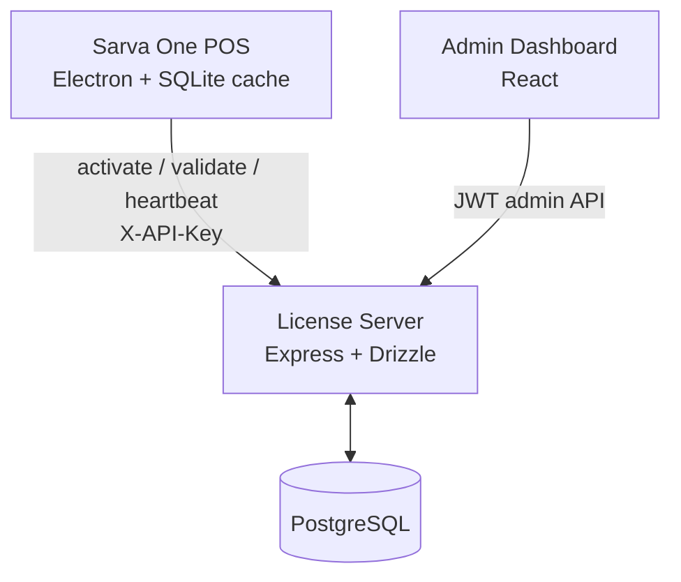

# Sarva One License Management System

This workspace contains the Sarva One license server, admin dashboard, and technical documentation for managing POS licensing, subscriptions, machine seats, feature access, heartbeats, audit history, and renewal records.

## Components

```text
sarvaone/
  sarvaone-admin/                         React admin dashboard
  sarvaone_lience_management/
    sarva-one-server/                     Express + TypeScript license API
  docs/
    api_reference.md                      Current REST API reference
    architecture.md                       System architecture
    licensing_model.md                    Licensing model and state rules
    licensing_system_improvement_plan.md  Implementation roadmap and status
    roadmap.md                            Strategic roadmap summary
  sarvaone_license_guide.md               Original reference guide
```

## Current Capabilities

- License creation, validation, activation, suspension, reactivation, archive, and renewal.
- RS256 signed license tokens for POS-side verification.
- Server-computed `effectiveStatus`.
- Subscription grace periods.
- Offline allowance metadata in signed license tokens.
- Multi-seat activation using `maxSeats`.
- Hashed machine activation records.
- Heartbeat telemetry.
- Admin dashboard metrics and alerts.
- Audit timeline through `license_events`.
- Soft archive instead of permanent license deletion.
- Manual payment recording and payment history.
- Plan catalog and entitlement schema scaffolding.

## High-Level Flow



## Important Runtime Concepts

### License State

The database stores admin status: `trial`, `active`, `expired`, or `suspended`.

The server computes runtime status: `trial`, `active`, `grace`, `expired`, or `suspended`.

Clients and dashboards should trust `effectiveStatus`.

### Signed Token

Activation and validation return `licenseToken`, an RS256 JWT containing:

- license id and key
- plan
- stored/effective status
- expiry and grace metadata
- feature flags
- max seats
- offline allowance
- token validity window

### Multi-Seat Activation

Each license has `maxSeats`. Active machines are tracked in `license_activations` using hashed machine IDs. Admins can deactivate one machine or reset all bindings.

### Audit And Archive

Important changes are recorded in `license_events`. Dashboard delete is now soft archive using `deletedAt` and `deletedBy`.

## Local Development

Server:

```bash
cd sarvaone_lience_management/sarva-one-server
npm install
cp .env.example .env
npm run db:migrate
npm run dev
```

Admin dashboard:

```bash
cd sarvaone-admin
npm install
npm run dev
```

## Validation

Server:

```bash
cd sarvaone_lience_management/sarva-one-server
npm run typecheck
```

Admin:

```bash
cd sarvaone-admin
npm run build
```

## Documentation Index

- [API Reference](docs/api_reference.md)
- [Architecture](docs/architecture.md)
- [Licensing Model](docs/licensing_model.md)
- [Improvement Plan](docs/licensing_system_improvement_plan.md)
- [Strategic Roadmap](docs/roadmap.md)
- [Server README](sarvaone_lience_management/sarva-one-server/README.md)
- [Admin README](sarvaone-admin/README.md)

---

Sarva One License Management System v2.0
