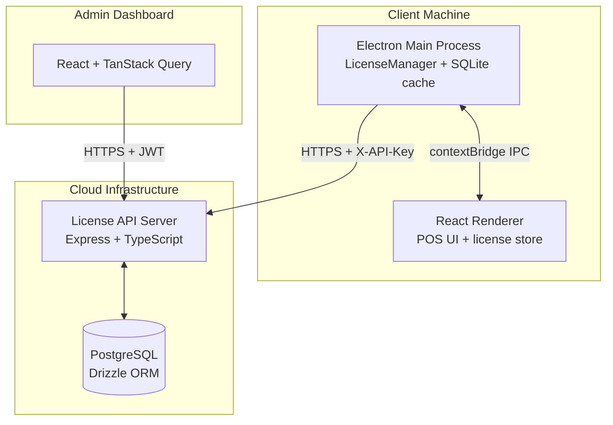
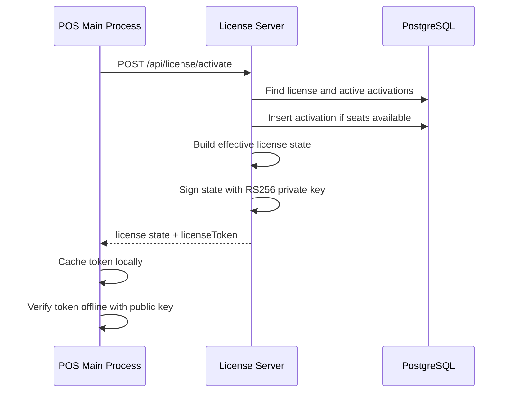

# System Architecture Reference

This document describes the current Sarva One License Management System architecture.

## 1. System Boundaries

The platform has three main nodes:

## 2. Subsystem Responsibilities

### POS Client App

- Gets a raw hardware fingerprint using `node-machine-id`.
- Calls `/api/license/activate`, `/validate`, and `/heartbeat` through the Electron main process.
- Caches a signed `licenseToken` for offline validation.
- Should verify the token with the server public key from `/api/license/public-key`.
- Uses `offlineDaysAllowance` from the signed token for offline behavior.

### License Server

- Owns all license state decisions.
- Computes `effectiveStatus`, `daysRemaining`, and `graceEndsAt`.
- Signs license state using RS256 private-key signing.
- Stores hashed machine IDs in `license_activations`.
- Enforces `maxSeats`.
- Records heartbeats, audit events, activation history, and payment events.
- Exposes admin dashboard data using server-computed state.

### Admin Dashboard

- Authenticates with JWT.
- Creates, edits, suspends, reactivates, archives, and renews licenses.
- Shows effective license status, audit timeline, activated machines, payment history, and heartbeat telemetry.
- Deactivates individual machine seats or resets all machine bindings.

## 3. Database Model

Current major tables:

- `licenses`: primary license/customer record, stored admin status, expiry, grace days, `max_seats`, soft archive fields.
- `license_activations`: hashed machine bindings, hostname, app version, last seen, deactivation timestamp.
- `heartbeats`: usage telemetry snapshots from activated POS machines.
- `license_events`: audit trail for admin actions and client/license security events.
- `admin_users`: dashboard users.
- `plans`: plan catalog scaffold.
- `plan_entitlements`: configurable entitlement scaffold.
- `payment_events`: manual/payment-gateway renewal history.

Legacy note: `licenses.machine_id` still exists for compatibility during migration. New enforcement should prefer `license_activations`.

## 4. License Token Flow

The token includes:

- `licenseId`
- `key`
- `plan`
- `storedStatus`
- `effectiveStatus`
- `expiresAt`
- `graceEndsAt`
- `daysRemaining`
- `features`
- `maxSeats`
- `issuedAt`
- `validUntil`
- `offlineDaysAllowance`
- `tokenVersion`

## 5. Effective Status

The database stores only admin status:

- `trial`
- `active`
- `expired`
- `suspended`

The server computes effective runtime status:

- `trial`
- `active`
- `grace`
- `expired`
- `suspended`

The admin dashboard and POS app should trust the server-computed `effectiveStatus`.

## 6. Multi-Seat Flow

Activation uses `maxSeats`:

1. Hash incoming `machineId`.
2. Check if the hash already has an active activation for the license.
3. If yes, allow activation/validation.
4. If not, count active activations.
5. If count is below `maxSeats`, insert a new activation.
6. If count is at or above `maxSeats`, reject with `MAX_SEATS_EXCEEDED`.

Admins can deactivate one activation or reset all machine bindings.

## 7. Audit And Archive Flow

Admin and client security events are written to `license_events`, including:

- license created/updated/renewed/suspended/reactivated/archived
- machine reset/deactivation
- activation success
- validation failure
- max seats exceeded
- admin login failures
- password changes
- manual payment recorded

Deleting a license from the dashboard is a soft archive. Archived licenses are hidden from normal list/detail/dashboard queries.

## 8. Payment/Renewal Flow

Current implementation supports:

- renewal quote scaffold
- manual payment recording
- license expiry extension
- payment event history
- audit events

Razorpay/Stripe order creation and webhook verification are planned but not fully connected yet.

## 9. Security Boundaries

- Client endpoints still require `X-API-Key`; comparison is timing-safe.
- License tokens use RS256 signing.
- Production requires `LICENSE_PRIVATE_KEY` and `MACHINE_ID_HASH_SECRET`.
- Admin setup can be protected by `ADMIN_SETUP_TOKEN`.
- Raw machine IDs are not stored in new activation records.
- External alert webhooks are not enabled by default because they can export customer/license data to third-party URLs.

---

Sarva One Platform Architecture Manual v2.0
